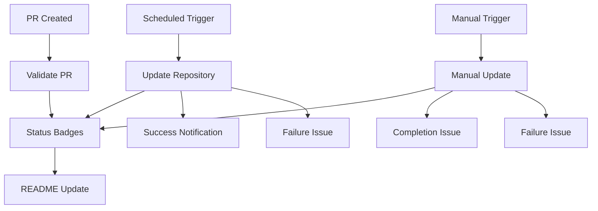

# 🚀 GitHub Actions Workflows

This directory contains comprehensive automation workflows for the AI Learning Repository. These workflows handle automated updates, validation, manual operations, and status monitoring.

## 📋 Available Workflows

### 🔄 Automated Repository Update (`update-repository.yml`)

**Purpose**: Automatically fetches, analyzes, and updates the repository with latest starred repositories.

**Triggers**:
- ⏰ **Scheduled**: Daily at 2:00 AM UTC
- 🔧 **Manual**: Via workflow dispatch with parameters

**Features**:
- ✅ Fetches latest starred repositories using GitHub API
- 🧠 Intelligent categorization (fast or full mode with AI embeddings)
- 📝 Automatic markdown generation
- 🔍 Smart change detection (only commits if changes exist)
- 📊 Comprehensive statistics and reporting
- 🚨 Automatic error notifications via GitHub issues
- 💾 Performance optimized with caching
- 🔄 Retry logic for robust operation

**Parameters** (Manual trigger):
- `force_update`: Force update even if no changes detected
- `analysis_mode`: Choose between `fast` (rule-based) or `full` (AI embeddings)
- `dry_run`: Test run without committing changes

**Outputs**:
- Updated repository data in `data/` directory
- Generated markdown files in `markdown_output/`
- Categorized repository analysis
- Comprehensive workflow summaries

---

### ✅ Pull Request Validation (`validate-pr.yml`)

**Purpose**: Validates pull requests with comprehensive testing and security checks.

**Triggers**:
- 🔀 **Pull Requests**: On open, sync, reopen for main/master branches
- 🔒 **External PRs**: Security checks via `pull_request_target`

**Features**:
- 🔒 **Security**: Validates external contributors
- 🧪 **Multi-Matrix Testing**: Syntax, functionality, and performance
- 📊 **Change Analysis**: Detailed file change reporting  
- 🔗 **Integration Testing**: Full pipeline validation
- 🤖 **Auto-merge**: For dependabot PRs after validation
- 📝 **Automated Comments**: PR analysis and status updates

**Test Matrix**:
1. **Syntax Validation**:
   - Python syntax checking
   - Code style analysis (flake8)
   - Import validation
   
2. **Functionality Tests**:
   - Module loading verification
   - Unit test execution
   - Basic functionality validation
   
3. **Performance Tests**:
   - Analysis performance benchmarks
   - Resource usage validation
   - Time complexity checks

**Security Features**:
- Contributor verification for external PRs
- Safe code execution environment
- Dependency validation

---

### 🚀 Manual Repository Update (`manual-update.yml`)

**Purpose**: Provides advanced manual control over repository updates with extensive configuration options.

**Triggers**:
- 🔧 **Manual Only**: Via workflow dispatch

**Advanced Parameters**:
- `target_user`: GitHub username to fetch stars from (default: repository owner)
- `analysis_mode`: `fast`, `full`, or `test` mode
- `update_type`: `incremental`, `full-refresh`, `categories-only`, or `markdown-only`
- `categories_filter`: Comma-separated list of specific categories to update
- `min_stars`: Minimum star threshold for repositories (default: 10)
- `max_repos`: Maximum repositories to process (1-10,000)
- `force_commit`: Force commit even without changes
- `create_backup`: Create backup before update
- `notify_on_completion`: Generate completion notification

**Features**:
- 🎯 **Targeted Updates**: Filter by categories, stars, or repository count
- 💾 **Backup System**: Automatic data backups with artifact storage
- 📊 **Detailed Reporting**: Comprehensive update summaries
- 🔍 **Input Validation**: Robust parameter validation
- 📢 **Smart Notifications**: Success/failure issue creation
- 🔄 **Flexible Workflows**: Multiple update strategies

**Use Cases**:
- Testing new analysis parameters
- Updating specific categories only
- Processing different user's starred repos
- Emergency updates with custom filters
- Batch operations with specific thresholds

---

### 📊 Status Badges Update (`status-badges.yml`)

**Purpose**: Maintains repository status badges and generates comprehensive status reports.

**Triggers**:
- 🔄 **Workflow Completion**: After other workflows complete
- ⏰ **Scheduled**: Daily at 3:00 AM UTC (after main update)
- 🔧 **Manual**: Via workflow dispatch

**Features**:
- 📊 **Real-time Status**: Updates workflow status badges
- 📈 **Statistics Tracking**: Repository metrics and analytics
- 📝 **Status Reports**: Detailed status documentation
- 🔄 **Automatic README Updates**: Keeps documentation current
- 📦 **Artifact Storage**: Status reports saved as artifacts

**Generated Content**:
- Workflow status badges in README
- Repository statistics (total repos, categories, last update)
- Detailed status reports
- Quick access links

## 🔧 Configuration & Setup

### Required Secrets

| Secret | Purpose | Required For |
|--------|---------|--------------|
| `GITHUB_TOKEN` | GitHub API access | All workflows |

*Note: `GITHUB_TOKEN` is automatically provided by GitHub Actions*

### Required Permissions

```yaml
permissions:
  contents: write    # For committing updates
  actions: read      # For workflow status
  issues: write      # For notifications
  pull-requests: write # For PR validation
  checks: write      # For status checks
```

### Repository Structure

The workflows expect this repository structure:

```
├── data/                          # Data storage
│   ├── starred_repos_latest.json  # Latest fetched data
│   └── categorized_repos.json     # Analysis results
├── markdown_output/               # Generated markdown
├── tools/                         # Python analysis tools
│   ├── fetch_stars.py            # GitHub API client
│   ├── analyze_repos.py          # AI analysis engine
│   └── generate_markdown.py      # Markdown generator
├── requirements.txt               # Python dependencies
└── .github/workflows/             # This directory
```

## 🚀 Usage Examples

### 1. Standard Daily Update
**Automatic**: Runs every day at 2 AM UTC
- Fetches latest starred repositories
- Performs fast analysis (rule-based)
- Updates repository if changes detected
- Commits with automated message

### 2. Manual Full Analysis
1. Go to **Actions** → **🚀 Manual Repository Update**
2. Click **Run workflow**
3. Set parameters:
   - `analysis_mode`: `full`
   - `update_type`: `full-refresh`
   - `create_backup`: `true`
4. Click **Run workflow**

### 3. Category-Specific Update
1. **Actions** → **🚀 Manual Repository Update**
2. **Run workflow** with:
   - `categories_filter`: `machine-learning,deep-learning,nlp`
   - `update_type`: `categories-only`
   - `min_stars`: `100`

### 4. Testing New Parameters
1. **Actions** → **🚀 Manual Repository Update**
2. **Run workflow** with:
   - `analysis_mode`: `test`
   - `max_repos`: `50`
   - `dry_run`: `true` (from main workflow)

## 📊 Monitoring & Troubleshooting

### Status Monitoring
- **Live Status**: Check workflow badges in README
- **Detailed Logs**: View individual workflow runs
- **Status Reports**: Download from workflow artifacts
- **Error Notifications**: Automatic GitHub issues for failures

### Common Issues & Solutions

| Issue | Solution |
|-------|----------|
| **API Rate Limits** | Workflows include retry logic and error handling |
| **Large Repository Count** | Use `max_repos` parameter to limit processing |
| **Analysis Timeouts** | Switch to `fast` mode or reduce repository count |
| **Permission Errors** | Ensure `GITHUB_TOKEN` has required permissions |
| **Dependency Issues** | Check requirements.txt and Python version |

### Debug Commands

```bash
# Test locally
cd tools
python fetch_stars.py --verbose --user YOUR_USERNAME
python analyze_repos.py --no-embeddings --verbose
python generate_markdown.py --verbose

# Check workflow syntax
yamllint .github/workflows/*.yml

# Validate Python code
flake8 tools/ --max-line-length=100
```

## 🔄 Workflow Dependencies



## 📈 Performance Metrics

### Typical Execution Times
- **Fast Analysis**: 30 seconds - 2 minutes
- **Full Analysis**: 5-10 minutes (first run: +model download)
- **PR Validation**: 2-5 minutes
- **Status Update**: 30 seconds

### Resource Usage
- **CPU**: Moderate during analysis phase
- **Memory**: 2-4GB for full analysis with embeddings
- **Storage**: ~100MB for models, ~10MB for data
- **API Calls**: ~1 call per starred repository

## 🔐 Security Considerations

### Built-in Security
- ✅ External PR validation and approval required
- ✅ Minimal required permissions
- ✅ Secure token handling
- ✅ Input validation and sanitization
- ✅ Safe code execution environment

### Best Practices
- Regular dependency updates (automated via dependabot)
- Workflow permission reviews
- Artifact retention policies
- Error logging without sensitive data exposure

## 🤝 Contributing to Workflows

### Development Guidelines
1. **Test Locally**: Validate syntax and logic before committing
2. **Small Changes**: Make incremental improvements
3. **Documentation**: Update this README for any changes
4. **Validation**: Use PR validation workflow for testing

### Workflow Modification Process
1. Create feature branch
2. Modify workflow files
3. Test with manual triggers
4. Create PR for validation
5. Merge after successful validation

---

## 📞 Support & Maintenance

### Automatic Maintenance
- Daily execution monitoring
- Error detection and notification
- Performance optimization
- Dependency management

### Manual Maintenance
- Weekly workflow review
- Monthly performance analysis
- Quarterly security audit
- Annual architecture review

### Getting Help
1. **Check Status**: Review latest workflow runs
2. **Read Logs**: Examine detailed execution logs
3. **Check Issues**: Look for automated error reports
4. **Debug Locally**: Run tools manually for testing

---

*🤖 These workflows are designed for reliability, security, and ease of use. They automatically handle most edge cases and provide comprehensive monitoring and notification systems.*

**Last Updated**: Auto-updated by status-badges workflow