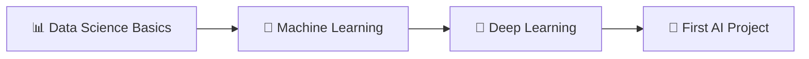
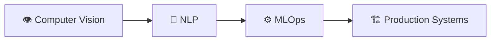
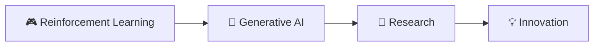

<div align="center">

# 🚀 Awesome AI Learning Repository Collection

<h3>A comprehensive, intelligently curated collection of 645+ AI and Machine Learning repositories</h3>

[](https://github.com/aiwithnick/awesome-ai-learning)
[](https://github.com/aiwithnick/awesome-ai-learning)
[](https://github.com/aiwithnick/awesome-ai-learning)
[](https://github.com/aiwithnick/awesome-ai-learning)

<p align="center">
  <a href="#-quick-start">Quick Start</a> •
  <a href="#-featured-categories">Categories</a> •
  <a href="#-learning-paths">Learning Paths</a> •
  <a href="#-statistics">Stats</a> •
  <a href="#-contributing">Contributing</a>
</p>

<br/>


</div>

<br/>

<div align="center">
  <h2>✨ Your Gateway to AI Excellence</h2>
  <p><i>From beginner tutorials to cutting-edge research - everything you need for your AI journey</i></p>
</div>

<br/>

## 🎯 Quick Start

<table>
  <tr>
    <td align="center" width="33%">
      <h3>🔰 New to AI?</h3>
      <a href="markdown_output/BEGINNER_GUIDE.md">
        
      </a>
      <p><sub>Structured 4-phase learning path</sub></p>
    </td>
    <td align="center" width="33%">
      <h3>🏆 Best of the Best</h3>
      <a href="markdown_output/TOP_REPOSITORIES.md">
        
      </a>
      <p><sub>Most impactful AI repositories</sub></p>
    </td>
    <td align="center" width="33%">
      <h3>📚 Full Collection</h3>
      <a href="markdown_output/INDEX.md">
        
      </a>
      <p><sub>Browse all 645+ repositories</sub></p>
    </td>
  </tr>
</table>

<br/>

## 🎨 Featured Categories

<div align="center">

| Category | Repositories | Avg Stars | Top Repository | Description |
|:---------|:------------|:----------|:--------------|:------------|
| 🤖 **[LLMs & Foundation Models](markdown_output/categories/llms_and_foundation_models.md)** | 140 | 14.6K | [generative-ai-for-beginners](https://github.com/microsoft/generative-ai-for-beginners) (93.7K ⭐) | Large language models, transformers, and foundational AI systems |
| 🛠️ **[Developer Tools & APIs](markdown_output/categories/developer_tools_and_apis.md)** | 139 | 22.7K | [AutoGPT](https://github.com/Significant-Gravitas/AutoGPT) (177.4K ⭐) | AI-powered development tools, automation, and APIs |
| 👁️ **[Computer Vision](markdown_output/categories/computer_vision.md)** | 35 | 8.2K | [pytorch-image-models](https://github.com/huggingface/pytorch-image-models) (34.9K ⭐) | Image processing, object detection, and visual AI |
| 📝 **[Natural Language Processing](markdown_output/categories/natural_language_processing.md)** | 42 | 11.3K | [mermaid](https://github.com/mermaid-js/mermaid) (81.7K ⭐) | Text processing, language understanding, and generation |
| 📊 **[Data Science & Analytics](markdown_output/categories/data_science_and_analytics.md)** | 49 | 11.4K | [pytorch](https://github.com/pytorch/pytorch) (91.9K ⭐) | Data analysis, visualization, and statistical modeling |
| 🧠 **[Machine Learning Frameworks](markdown_output/categories/machine_learning_frameworks.md)** | 59 | 30.0K | [xgboost](https://github.com/dmlc/xgboost) (27.2K ⭐) | Core ML libraries and frameworks |
| 🎓 **[Educational Resources](markdown_output/categories/educational_resources.md)** | 39 | 25.7K | [freeCodeCamp](https://github.com/freeCodeCamp/freeCodeCamp) (424.7K ⭐) | Tutorials, courses, and learning materials |
| 🎮 **[Reinforcement Learning](markdown_output/categories/reinforcement_learning.md)** | 19 | 6.1K | [unsloth](https://github.com/unslothai/unsloth) (42.9K ⭐) | RL algorithms and game-playing AI |

</div>

<details>
<summary><b>View All 13 Categories</b></summary>

- 🎵 **[Audio & Speech](markdown_output/categories/audio_and_speech.md)** - Speech recognition and audio synthesis (6 repos)
- 🌐 **[Multimodal AI](markdown_output/categories/multimodal_ai.md)** - Cross-modal AI systems (2 repos)
- 🔬 **[Research Papers & Implementations](markdown_output/categories/research_papers_and_implementations.md)** - Academic papers with code (19 repos)
- ⚙️ **[MLOps & Infrastructure](markdown_output/categories/mlops_and_infrastructure.md)** - Production ML systems (9 repos)
- 🔧 **[Other](markdown_output/categories/other.md)** - Specialized tools and utilities (87 repos)

</details>

<br/>

## 🛤️ Learning Paths

<div align="center">

### 🌱 **Beginner Path** - *Start Your AI Journey*



### 🚀 **Intermediate Path** - *Specialize Your Skills*



### 🔥 **Advanced Path** - *Push the Boundaries*



</div>

<br/>

## 📊 Statistics

<div align="center">

| **Metric** | **Value** |
|:-----------|:----------|
| 📚 Total Repositories | **645** |
| ⭐ Total Stars | **11.4M** |
| 📈 Average Stars | **17.7K** |
| 🐍 Python Repos | **286** (44%) |
| 📓 Jupyter Notebooks | **64** (10%) |
| 🟦 TypeScript Projects | **48** (7%) |
| 🌍 Languages Covered | **31** |
| 🏷️ Categories | **13** |
| 🔄 Last Updated | **July 30, 2025** |

</div>

### 📈 Language Distribution

```
Python       ████████████████████████████████████████ 44%
Jupyter      ████████                                 10%
TypeScript   ███████                                   7%
JavaScript   ██████                                    6%
Others       █████████████████████████████████        33%
```

<br/>

## 🤝 Contributing

We welcome contributions to make this collection even better!

### How to Contribute

1. **⭐ Star repositories** - New interesting AI repos will be automatically discovered
2. **🐛 Submit issues** - Report problems or suggest improvements
3. **💡 Enhance algorithms** - Help improve our categorization system
4. **📝 Improve docs** - Better explanations help everyone learn

See our [Contributing Guide](CONTRIBUTING.md) for detailed instructions.

<br/>

## 🔧 Automated Maintenance

<div align="center">

[](https://github.com/aiwithnick/awesome-ai-learning/actions)
[](https://github.com/aiwithnick/awesome-ai-learning/actions)

</div>

This repository is automatically maintained through GitHub Actions:

- 🔄 **Daily updates** at 2 AM UTC
- 🧹 **Automatic cleanup** of broken links
- 📊 **Fresh statistics** every 24 hours
- 🏷️ **Smart categorization** using NLP

<br/>

## 📚 Methodology

Our intelligent curation system:

1. **🔍 Discovery** - Automatically finds high-quality AI repositories
2. **🏷️ Categorization** - Uses NLP to intelligently categorize repos
3. **📊 Scoring** - Multi-dimensional scoring system:
   - ⭐ **Popularity** - Stars, forks, and community engagement
   - 🔄 **Freshness** - Recent updates and maintenance
   - 📚 **Learning Value** - Documentation quality and educational content
   - 🎯 **Relevance** - How well it fits AI/ML learning goals

<br/>

## 🌟 Featured Projects

<table>
  <tr>
    <td align="center">
      <a href="https://github.com/freeCodeCamp/freeCodeCamp">
        
      </a>
      <br>
      <b>freeCodeCamp</b>
      <br>
      424.7K ⭐
    </td>
    <td align="center">
      <a href="https://github.com/awesome-selfhosted/awesome-selfhosted">
        
      </a>
      <br>
      <b>Awesome Selfhosted</b>
      <br>
      239.4K ⭐
    </td>
    <td align="center">
      <a href="https://github.com/Significant-Gravitas/AutoGPT">
        
      </a>
      <br>
      <b>AutoGPT</b>
      <br>
      177.4K ⭐
    </td>
    <td align="center">
      <a href="https://github.com/microsoft/generative-ai-for-beginners">
        
      </a>
      <br>
      <b>Gen AI for Beginners</b>
      <br>
      93.7K ⭐
    </td>
    <td align="center">
      <a href="https://github.com/pytorch/pytorch">
        
      </a>
      <br>
      <b>PyTorch</b>
      <br>
      91.9K ⭐
    </td>
  </tr>
</table>

<br/>

## 📜 License

This project is licensed under the MIT License - see the [LICENSE](LICENSE) file for details.

<br/>

<div align="center">
  
  
  <h3>🚀 Happy Learning!</h3>
  
  <p>Made with ❤️ by the AI community for the AI community</p>
  
  <a href="https://github.com/aiwithnick/awesome-ai-learning">
    
  </a>
</div>